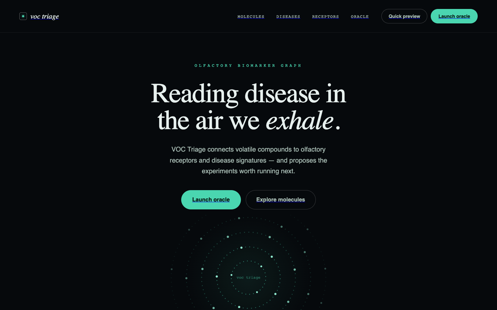

<p align="center">
  
</p>

# VOC-Triage

A machine-learning research tool that reads breath volatile organic compound (VOC) profiles and flags disease-associated chemical signatures, built for the UCSF QBI Hackathon 2026.

**Web interface:** <https://voc-t-design-1.vercel.app> ([nikhilesh-s/voc-triage-web](https://github.com/nikhilesh-s/voc-triage-web)) · **This repo:** model training and the FastAPI backend

## Why

Breath carries hundreds of VOCs, and some shift with respiratory disease. VOC-Triage is meant to help researchers find which compounds separate COPD, asthma and bronchiectasis, and to prioritize samples for follow-up. It is a research and triage aid, not a diagnostic.

## Model

A random forest classifier (100 trees, max depth 12) trained on 121 breath samples: 33 COPD, 53 asthma, 35 bronchiectasis.

| Metric (5-fold stratified CV) | Score |
|---|---|
| Accuracy | 97.5% (±2.0%) |
| Precision | 97.9% (±1.7%) |
| Recall | 97.5% (±2.0%) |
| F1 | 97.5% (±2.0%) |

With only 121 samples these numbers are optimistic; a larger, independently collected dataset is the next step before reading much into them.

Most discriminative compounds:

| Rank | VOC | Importance | Associated with |
|---|---|---|---|
| 1 | Hydrogen sulfide | 13.58% | COPD |
| 2 | Toluene | 12.33% | Asthma |
| 3 | Dimethyl trisulfide | 11.93% | COPD |
| 4 | Xylene | 8.51% | Asthma |
| 5 | Limonene | 7.32% | Bronchiectasis |
| 6 | Dimethyl sulfide | 7.14% | COPD / bronchiectasis |
| 7 | Pinene | 4.61% | Bronchiectasis |
| 8 | Ethylbenzene | 3.09% | Asthma |
| 9 | Acetone | 2.25% | COPD |
| 10 | Trimethylpyrazine | 1.20% | |

The pattern lines up with the biology: sulfur compounds in COPD (bacterial dysbiosis), aromatics in asthma (airway inflammation), and terpenes plus sulfur in bronchiectasis (chronic infection).

## API

| Method | Path | Purpose |
|---|---|---|
| POST | `/api/triage/predict` | Predict disease from a VOC profile; returns confidence, a triage score and the top contributing VOCs |
| GET | `/api/diseases` | Supported diseases |
| GET | `/api/disease/{disease}` | Disease profile |
| GET | `/api/voc/{voc_name}` | Compound profile |
| GET | `/api/panel/{disease}` | Suggested biomarker panel |
| GET | `/api/feature-importance` | Top 15 VOC features |
| GET | `/api/model-info` | Model metadata |
| GET | `/api/demo/sample/{disease}`, `/api/demo/prediction/{disease}` | Demo data |
| GET | `/health`, `/docs` | Health check, Swagger UI |

Example request to `/api/triage/predict`:

```json
{
  "sample_id": "TEST_SAMPLE_001",
  "voc_intensities": {
    "hydrogen sulfide": 35000.0,
    "dimethyl sulfide": 28000.0,
    "acetone": 15000.0
  }
}
```

**Stack:** Python 3.11 · scikit-learn · pandas · FastAPI · Render

## Run locally

```bash
git clone https://github.com/nikhilesh-s/voc-triage.git
cd voc-triage
python3 -m venv venv && source venv/bin/activate
pip install -r backend/requirements.txt
uvicorn backend.main:app --reload
```

The API runs at <http://localhost:8000>, with interactive docs at `/docs`.

### Retraining

Put one CSV per class in `data/` (`COPD_peaks.csv`, `Asthma_peaks.csv`, `Bronchiectasis_peaks.csv`; rows are samples, columns are VOC intensities), then run:

```bash
python backend/train_model.py
```

This writes `backend/model.pkl` and `backend/feature_importance.csv`.

## Repository layout

```text
backend/
  main.py            FastAPI app (all endpoints)
  train_model.py     Training and cross-validation
  model.pkl          Trained model
  requirements.txt
render.yaml          Render deployment config
```
